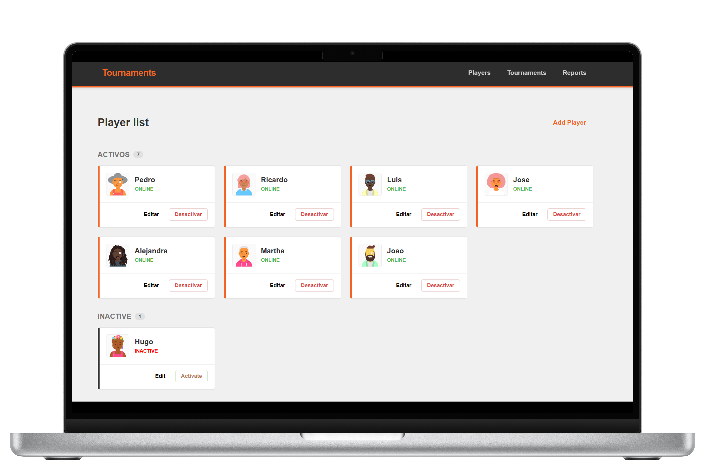
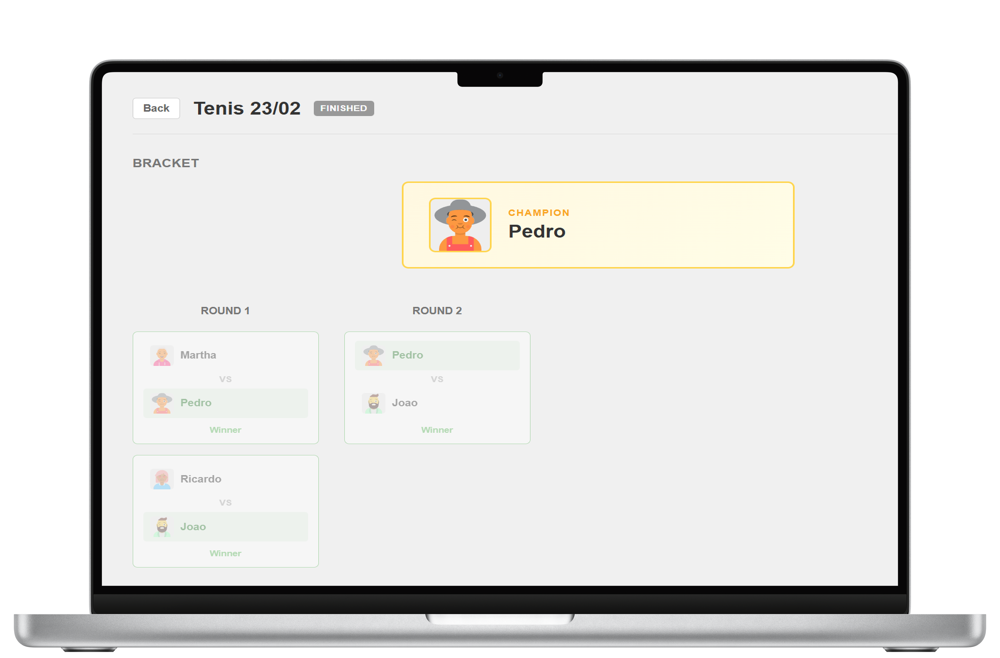

# Tournament Manager
Web application for managing KO tournaments. It allows you to create players, organize tournaments, advance through rounds by selecting winners, and view statistics.

## Architecture
- Frontend: Angular
- Backend: Python with FastAPI
- Angular -> HTTPS (JSON) -> FastAPI -> SQLAlchemy -> Database

## Features

### Player Management
- Create, edit, activate, and deactivate players.
- Avatars generated via DiceBear API.

### Tournaments
- Create tournaments and select participants.
- Generate brackets with a BYE system.
- Advance rounds to the final and display the winner.

### Reports
- Player ranking based on wins and losses.
- Match history per tournament.
# 

<div align="center">
  <table>
    <tr>
      <td align="center">
        <strong>Players</strong><br/>
        
      </td>
      <td align="center">
        <strong>Champion</strong><br/>
        
      </td>
    </tr>
  </table>
</div>

## Project Structure

```
backend/
├── app/
│   ├── main.py                # API entry point
│   ├── database.py            # Database connection
│   ├── models/                # Database models
│   │   ├── player.py
│   │   ├── tournament.py
│   │   ├── match.py
│   │   └── tournament_player.py
│   ├── schemas/               # Data validation 
│   │   ├── player_schemas.py
│   │   ├── tournament_schemas.py
│   │   └── match_schemas.py
│   └── routers/               # Endpoints
│       ├── players_router.py
│       ├── tournaments_router.py
│       └── reports_router.py
frontend/
├── src/app/
│   ├── core/
│   │   └── services/              # HTTP services
│   ├── features/
│   │   ├── models/                # Frontend models/interfaces
│   │   │   ├── player.model.ts
│   │   │   └── tournament.model.ts
│   │   ├── players/               # Player management module
│   │   ├── tournaments/           # Tournament management module
│   │   └── reports/               # Reports management module
│   └── app.routes.ts              # Navigation routes
```

## Endpoints

| Method | URL                         | Description               |
|--------|-----------------------------|---------------------------|
| GET    | /players                    | Get all players           |
| POST   | /players                    | Create a player           |
| PUT    | /players/:id                | Edit a player             |
| PATCH  | /players/:id/toggle         | Toggle player status      |
| GET    | /tournaments                | List all tournaments      |
| POST   | /tournaments                | Create a tournament       |
| GET    | /tournaments/:id            | Get specific tournament   |
| POST   | /tournaments/:id/generate   | Create bracket            |
| GET    | /tournaments/:id/bracket    | Get matches               |
| POST   | /tournaments/:id/next-round | Advance to next round     |
| GET    | /reports/leaderboard        | Statistics leaderboard    |